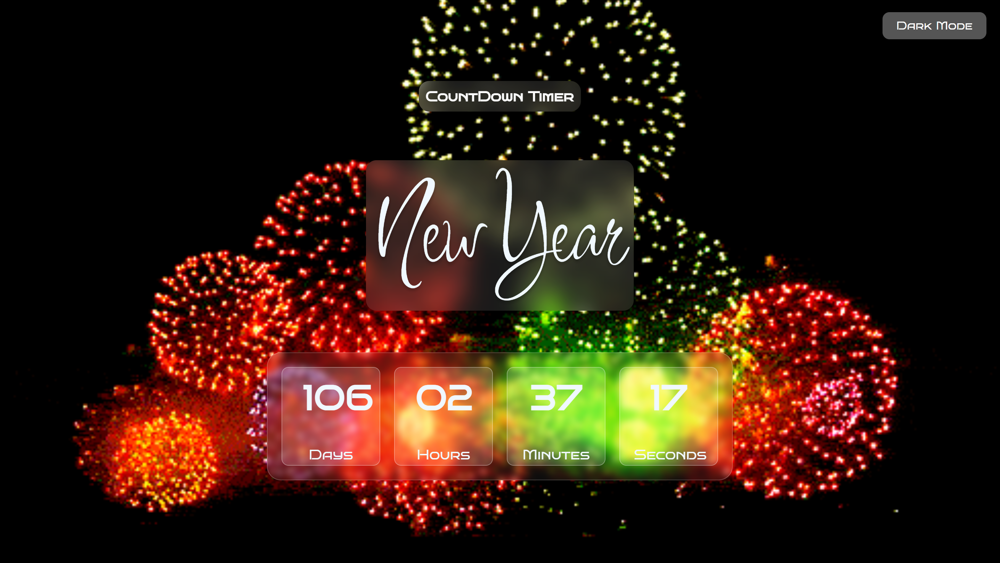
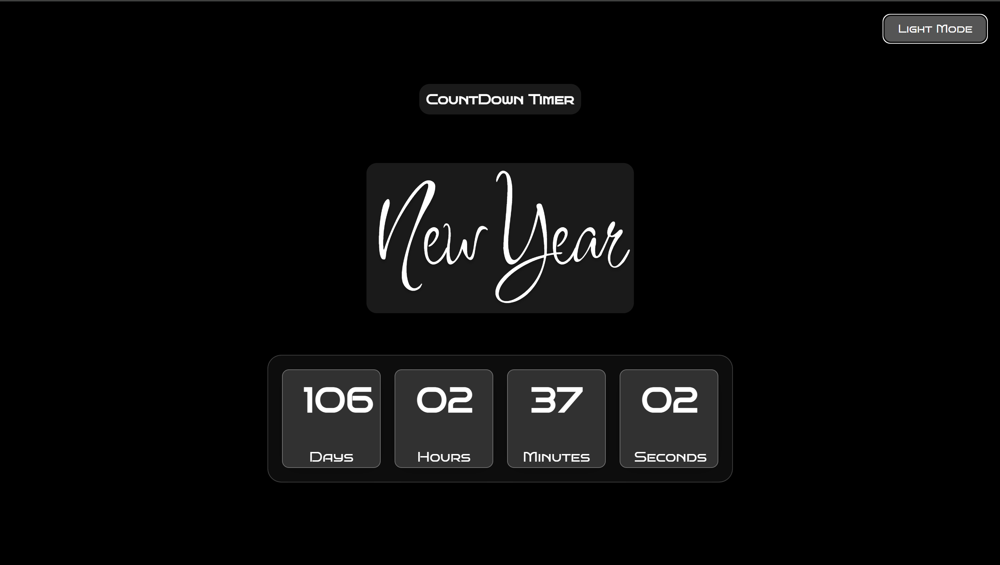

# Countdown Timer Application 🎉🕒



## Table of Contents
1. [Overview](#overview)
2. [Features](#features)
3. [Installation](#installation)
4. [Usage](#usage)
5. [Technologies Used](#technologies-used)
6. [Screenshots](#screenshots)
7. [Future Enhancements](#future-enhancements)
8. [License](#license)

---

## Overview
This is a beautifully designed **Countdown Timer** that counts down to the **New Year** or any event. The application features a clean and modern UI enhanced with **glassmorphism effects**. Users can track days, hours, minutes, and seconds left until the event, and the app adjusts responsively across all device sizes.

The application offers an engaging visual experience with subtle animations, background images, and a dark mode switcher.

---

## Features
- **Responsive Design:** The UI automatically adjusts for all screen sizes, ensuring a seamless experience on mobile, tablet, and desktop devices.
- **Countdown Timer:** The app displays days, hours, minutes, and seconds remaining for the event, updating dynamically in real-time.
- **Glassmorphism UI:** The timer boxes feature a sleek glass-like design with transparent backgrounds, soft shadows, and blurred backdrops for a modern look.
- **Dark Mode:** Users can toggle between light and dark modes for a personalized viewing experience.
- **Background Animation:** The countdown timer is placed over a dynamic background to enhance the festive mood.
- **Customizable Event Date:** Future updates will allow users to set their own event date for countdown.

---

## Installation

1. **Clone the repository:**

   ```bash
   git clone https://github.com/username/countdown-timer.git
